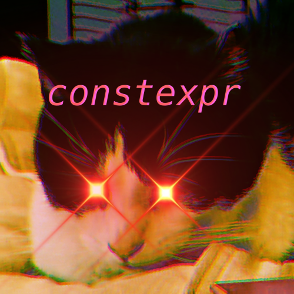

# Wi21.CIS.D022B.02Z

*CIS 22B - Intermediate Programming Methodologies in C++*



What|Opens|Closes
-|-|-
[lab01](lab01)|`01/05`|`01/15`
[lab02](lab02)|`01/03`|`02/05`
[lab03](lab03)|`02/06`|`02/19`
[lab04](lab04)|`02/06`|`03/05`
[lab05](lab05)|`02/06`|`03/19`

## Reasons why you shouldn't steal my code:

- You learn nothing
- You make me look bad
- My code looks bad
- My coding style is somewhat unconventional
- You're going to have a difficult time explaining how things work if you get caught
- You're breaking the [De Anza Academic Honesty Policy](ACADEMIC_HONESTY.md)

## Anyways

You know, this course looks like it's going to be a whole lot of suffering if I
don't figure out how to code effectively.

The prof for this course seems pretty baller.
I think this is going to be a fun one.

## Learnings

This is just stuff I figured out or learned by doing assignments in here.
There's way more actual other cool stuff that I learned during this time but I
wouldn't really say that this course was the cause of it.

### Constructor uniform field initialization:

```cpp
// as seen in @coalpha/coalpha.github.io/cxx/constructor_initializer.cxx
class NoError {
   char c;
public:
   NoError(int c): c(c) {};
};

class HasError {
   char c;
public:
   HasError(int c): c{c} {};
};
```

### Exceptions (bad)

```cpp
// etc
throw {} catch (...) {};
```

### Member function pointers

```cpp
template<class Clazz, class ...Ts>
using method = void (Clazz::*)(Ts ...args);
```

### cin to string

```cpp
string hello;
cin >> hello; // with "hello world"
```
